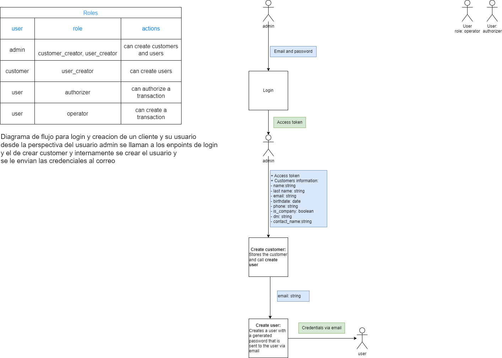

#Evaluacion tecnica

## Diagramas de flujo

[Ver Diagrama](https://viewer.diagrams.net/index.html?tags=%7B%7D&highlight=0000ff&edit=_blank&layers=1&nav=1&title=Diagrama%20bakend.drawio#R7Vxbb9s2FP41BrqHDtY17qPtJC2KFC0aDNueAlqiLTaUqFF0bPfX71CiJEuknGSxraQTECDiEW%2F6zncuPFIycubx9iNHafSFhZiO7HG4HTmXI9u2fMuDX1KyKyQXnl0IVpyEqlMtuCU%2FsRKOlXRNQpw1OgrGqCBpUxiwJMGBaMgQ52zT7LZktLlqilZYE9wGiOrSP0kookI68ca1%2FBMmq6hc2RqrOzEqOytBFqGQbfZEztXImXPGRHEVb%2BeYSvBKXIpx1x13q41xnIinDLD%2FuH%2B4%2FJpeT7cP4efN3fLeuZu8V7M8ILpWDzznGHEJKCUwMX43X2eCxZj%2Fpp5C7Epo4IFSebmO6TVHMVzONhER%2BDZFgZRvgBEgi0RMoWXBZcoITMmvHmBmqZexHKJQtRzZikosfdlSm8Nc4G3nU1sVlkBCDFsVfAdd1ABXoa%2Fo56jmptal5ZUqi%2FYVWekNKQatqrlrkOFC4fwMzC80JHEInFNNxkXEVixB9KqWzjhbJyEOFWZ1nxvGUgXuDyzEThkQWgvWhL5YUy50GEjYF1vzAB%2FYvzJggfgKiwP9fLNiOKZIkIfmPkwg50OnnKPdXoecQtnezN%2BkoNa3ZzcVfuG3rOKR%2FpUB1xoutlDru3qW%2F04By%2B%2BDA6BpvvtLjv%2FdK5t%2F79%2B73KrJi9ZOtXrgjuW%2BkDwvslBb84rTMCbJIQ84DQTjgJV0VgTCxw1aYPqNZUQQlkCXBRPgRvc6TClZyRuCpSZLfZHT832vaQQGt%2BcYnJ5%2FKpfn6GGmCC8jaX4%2BhfVnC4g6%2FkpePS3mvCrELavpRvxJz4i7GuJ%2FZJh3wA0hP2TyeZnskWdwKvy%2FHQ3YH16ZBjxNAwCNyDVwDb45gl8cr0gmpFpaIDdd%2FSNZ1ZJQOmdUqgLGOsvl0g4CkGeCs3u8dyf0F77nH8nFtOJmBf9%2BZmWfE%2B%2FSAt9sXuU%2FMTbafeRV1YmnI096dEArETtNXuU%2FbnOUrQyR%2FO0ZnDW%2B6N3i9NNjGV3SBrz%2BP2t5yp3FQG0A35mO023VfJ9Hg6mbiwAf8R4VYWIayAjES2mIA8ZREVqmUluckgTn4JbzlxGtinGl4OviR14cmMK2Pmcwg%2BoAj71oDwJZ2pZFvC15zgNSvJRrT3KZvlscI0KLvQGDSLLSQ3SKsmzDeCiZfLCj%2BSFaZDeHY4X6ZbHbGYNeS5oXLCTfJe1ZIpQftGzVvkYxoZKRnzB9wHLWpqmYLOkIxuC2jvUTU%2FTxDbbw4WS2oJ8ZBlt4vi0IcKDJYYqvVR6bdyqS2v%2BpFZQh9fVYgd1LDvYK6hqW%2B8TkzXth8vYyJ6WfCuv8KFCHbnkJB0J5Nn%2FzSZJrqveeN0e6eDwlfcPHQMttFT6qdn%2BITzTEP%2BIm4CRZsqOCHXp4EromsCf2wvGPBbbTorfXO73t4QgwpD1nTnv8lsvxDJW%2BM6c9XdXWdu10Q2KKcsbmeKo70t8EEaHhDdqxtdxsJlBwX7ZmEePkJ%2FRHJbBwm5fasP2WO0pYvkA96FZOppbhOINh30qsrZboC9o2Ot6gTJQbZJSiNCOLfMtWRe2ZKvI%2BxWseQfmTpu4tT9d99e1A432uc0D5arXv4CBQsqJ4z%2BW2qljGF8im98ft5RAFP5ZAVjWTYSbTKHeE4petV5xH9kxmuHqBoUVM6V216KWIZOBWy1uYXUoGNIC1bvI%2Bl24t%2Ba5QcpuOJiJhKJ0gnAcEEmhRmYYqTcJGvRn8ALBzmeh7sPE5tK26DT%2ByOxdzlsCzIJJzCgOJN1gS%2BSj8POABdNaWtPGfxtKy3%2FE9lF4ZLbhRVZYa9Bi%2Fy09Z9niFEwwRF4f6i6CBM6flTPmhVH%2Bc0Y8uBWc4o%2FKTLEmY73CZQ3w58OPM%2FLiY9MwPp8unlJWEO6LcSrKOF4Z0aGDIaRlijd2%2BXYh%2BFp9XZaYhOT52ctyuD5iyY8s1EcBxf%2Fns%2BEOHt0ryT1eH5PiEbmry3OTYTNKTBbKuRIcCOHcDP3rmhyERPjM%2FulxHIENIMFCkd4oYcuEzU2TcQZGh9tI3N0xZ8JnJYXpJIsmxIFxEoXzVmhMkNL10HehxYnqYctaz0sPt8h1plOt08B39kcPrOzd1u3xHmJCBGn1SY9J3WuraHdQg2V3A4hQlu4IhC8YoRvpHzwNFTnywHfeeluoUySv2Q%2B3t6LW31ovpqhT3mO7Lo8uvW3lz9L%2F%2BU35qeD1wUvdUWP8rrrvpn80MJdlXQY0Tltzk967V%2F7woXEz9n0Ocq38B)

### Palabras clave
- lbrt
- swift
- batch
usuarios 
- se les solicitara telefono

que se genere un otp:
enviar otp por gmail con vigencia de 5 minutos para autorizar la transaccion

usar jwt para la autorizacion

agregar control de usuarios
creacion de usuarios
- pefiles
- roles
 - operador
  realizar las operaciones
 - autorizador
 - confirmar las operaciones o rechazarlas
 antes de: lista para ver detalles para ver que se va a autorizar
 depues de: algo que se debe hace nates de autorizar una t

 actividades 

configuracion de heramientas

modelado de bse de datos
 
creacion de tabla x

trabajra por spring

cada spring de 2 semanas

* soapui

planificacion que se pueda 
dar un entregable 
(en orden primero lo mas crucial login, luego transacciones)

